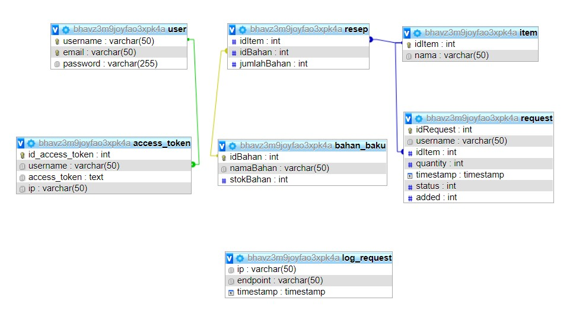

# Dorayaki-Factory-Server

## Deskripsi
Webservice yang digunakan pada sistem ini adalah jax-ws (Java API for XML Web Services), yang merupakan api standard untuk membuat dan menggunakan Web Services SOAP (Simple Object Access Protocol). Pada sistem yang dibuat, webservice secara umum digunakan untuk menghubungkan toko ke back end nodejs.

## Skema basis data

## Pembagian tugas

REST
Back end pabrik fungsi request dorayaki : 13519161, 13519071, 13519027
Back end pabrik fungsi bahan : 13519027
back end pabrik fungsi resep : 13519071, 13519027
Back end pabrik fungsi login : 13519161, 13519027
Back end pabrik fungsi register : 13519071, 13519027
Back end pabrik fungsi notif email : 13519027
